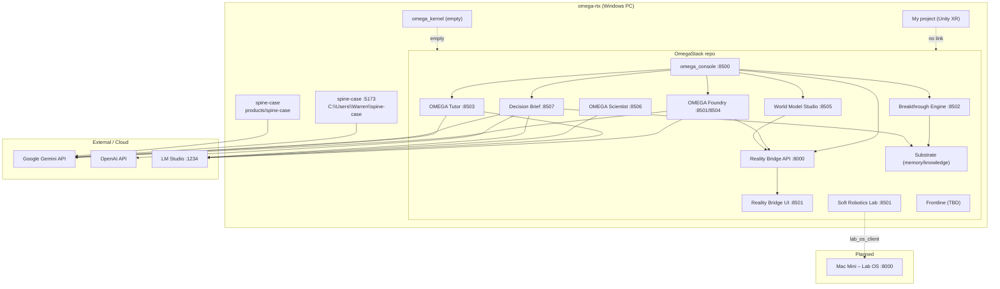

# omega-rtx Architecture Diagram

High-level view of projects on omega-rtx and how they connect. See [OMEGA_RTX_PROJECT_ANALYSIS.md](OMEGA_RTX_PROJECT_ANALYSIS.md) for full analysis.

---

## System context

- **omega-rtx:** Windows PC (this machine).
- **OmegaStack:** Monorepo of research products; Reality Bridge :8000 and Substrate are shared.
- **spine-case:** Standalone app (also a copy under OmegaStack/products).
- **omega_kernel:** Empty directory.
- **My project:** Unity XR; no link to others.

---

## Mermaid diagram

---

## Port map (quick reference)

| Port | Service |
|------|---------|
| 8000 | Reality Bridge API (shared validation) |
| 8500 | OMEGA Console (entry point) |
| 8501 | Reality Bridge Dashboard / Foundry / Soft Robotics Lab |
| 8502 | Breakthrough Engine |
| 8503 | OMEGA Tutor |
| 8504 | OMEGA Foundry (alternate) |
| 8505 | World Model Studio |
| 8506 | OMEGA Scientist |
| 8507 | Decision Brief |
| 1234 | LM Studio (optional local LLM) |
| 5173 | spine-case (Vite dev) |
