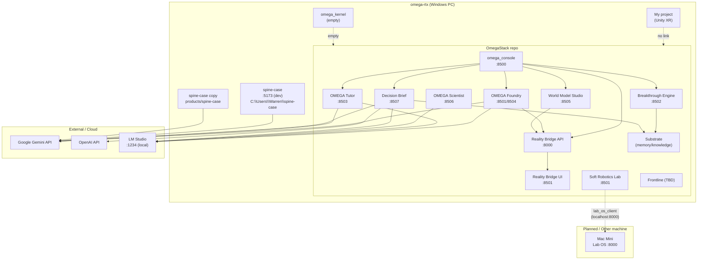

# omega-rtx — Deep Project Analysis & Architecture

**Role:** Senior infrastructure engineer / systems architect  
**Scope:** OmegaStack, omega_kernel, spine-case, My project  
**Date:** 2025-02-04

---

## Executive Summary

| Project       | Purpose | Tech | Connections | State        |
|---------------|---------|------|-------------|--------------|
| **OmegaStack**| Research OS: discover, validate, track, teach, build | Python (Streamlit, FastAPI), MuJoCo, ChromaDB, LLMs | Reality Bridge :8000, LM Studio :1234, Gemini/OpenAI, Substrate, omega-lab localhost:8000 | **Working** (multi-product; some products in-progress) |
| **omega_kernel** | (Reserved name) | — | None | **Empty** (directory exists, 0 files) |
| **spine-case** | Pre-op cognitive support for spine surgeons | React 19, TypeScript, Vite, Tailwind, Gemini 2.0 Flash | Google Gemini API only | **Working** (MVP complete) |
| **My project** | Unity XR application | Unity 2022.3, XR Hands, Oculus, OpenXR | None (standalone) | **Unknown** (Unity project; no runtime checks) |

**Cross-machine:** Tailscale for VPN; no project-specific sync/backup scheduled tasks. OmegaStack’s omega_lab/soft_robotics_lab reference “Mac Mini IP later” for Lab OS (localhost:8000 today).

---

## 1. Project: OmegaStack

**Path:** `C:\Users\Warren\OmegaStack`

### Purpose

Unified research platform (“translation layer between research and reality”): discover hypotheses, validate designs in physics, track to breakthrough, teach, and build. Products run through a **Translation Trinity** (SRFC / TSRFC / VRFC) for physical/workflow/reality validation.

### Tech Stack

| Layer | Technology |
|-------|------------|
| Language | Python 3.x (root: 3.13.9 typical) |
| UI | Streamlit (most products), some FastAPI (Reality Bridge) |
| Simulation | MuJoCo (3.x), optional Isaac Sim (C:\isa) |
| Memory / knowledge | ChromaDB, sentence-transformers, networkx (Substrate) |
| LLMs | LM Studio (localhost:1234), Gemini, OpenAI (env-driven) |
| Build / run | Makefile, pip, optional conda env `compute` |

### Entry Points

| Product | Port | Command (from repo root or product dir) |
|---------|------|----------------------------------------|
| OMEGA Console | 8500 | `make console` or `cd products/omega_console && streamlit run app.py --server.port 8500` |
| Reality Bridge API | 8000 | `uvicorn app:app --host 0.0.0.0 --port 8000` (in `products/reality_bridge`) |
| Reality Bridge Dashboard | 8501 | `streamlit run dashboard.py --server.port 8501` |
| Breakthrough Engine | 8502 | `streamlit run app.py --server.port 8502` (in `products/breakthrough_engine`) |
| OMEGA Tutor | 8503 | `streamlit run app.py --server.port 8503` (in `products/omega_tutor`) |
| OMEGA Foundry | 8501/8504 | Streamlit app (see omega_console for port mapping) |
| World Model Studio | 8505 | `streamlit run app.py --server.port 8505` |
| OMEGA Scientist | 8506 | `streamlit run app.py --server.port 8506` |
| Decision Brief | 8507 | `streamlit run app.py` (in `products/enterprise/decision_brief`) |
| Soft Robotics Lab | 8501 | Streamlit multi-page app |

### Connections (what it talks to)

- **Reality Bridge (localhost:8000)**  
  - Used by: omega_console (health, `/validate`), omega_foundry (validate), world_model_studio (validate).  
  - API: `/health`, `/validate` (MJCF), returns validation + optional audit bundle.
- **LM Studio (localhost:1234)**  
  - Used by: decision_brief, omega_scientist (contradiction_miner, cross_domain, failure_analyzer), omega_foundry (intent_parser, voice_design), omega_tutor (tutor_engine).  
  - Fallback when Gemini/OpenAI not set.
- **Google Gemini / OpenAI**  
  - Env: `GEMINI_API_KEY`, `GOOGLE_API_KEY`, `OPENAI_API_KEY`.  
  - Used by: decision_brief, omega_tutor, omega_foundry, omega_scientist, frontline.
- **Substrate (shared)**  
  - `products/shared/substrate`: VectorStore, KnowledgeGraph, Lineage, CrossProductConnector, Temporal.  
  - Used by: breakthrough_engine (hypothesis_ledger), decision_brief (substrate_integration).
- **omega-lab (Lab OS)**  
  - `http://localhost:8000` in omega_lab runner/orchestrator and soft_robotics_lab `lab_os_client.py` — “Change to mac-mini IP later”.
- **External:**  
  - CDN (e.g. three.js in omega_foundry), findahelpline.com (frontline crisis), example webhooks in reality_bridge data.

### State

- **Working:** Reality Bridge, omega_console, breakthrough_engine, omega_tutor, omega_foundry, world_model_studio, omega_scientist, decision_brief, soft_robotics_lab (with gripper zoo, research memory).  
- **In-progress / planned:** Frontline, Guardian Runtime adoption across agents, omega-lab cognition server (currently localhost, future Mac Mini).  
- **Dependencies:** Python venv or conda, `pip install -r requirements.txt`, product-level `requirements.txt`; MuJoCo for validation/simulation products; optional LM Studio for local LLM.

---

## 2. Project: omega_kernel

**Path:** `C:\Users\Warren\omega_kernel`

### Purpose

Unknown. Directory exists but contains **no files** (empty or placeholder).

### Tech Stack

None.

### Entry Points

None.

### Connections

None.

### State

**Empty / placeholder.** No code, config, or references from OmegaStack or spine-case.

---

## 3. Project: spine-case

**Path:** `C:\Users\Warren\spine-case` (standalone).  
**Also:** `OmegaStack\products\spine-case` (slim variant with server-side API route for Gemini key).

### Purpose

Pre-operative cognitive support for spine surgeons: case synthesis, blind-spot surfacing, pre-op optimisation planning, simplified mode for non-specialists. Explicitly **not** diagnostic or recommendation-giving; safety-first (disclaimers, input/output filters).

### Tech Stack

| Layer | Technology |
|-------|------------|
| Frontend | React 19, TypeScript |
| Build | Vite 7 |
| Styling | Tailwind CSS |
| AI | Google Gemini 2.0 Flash (client-side key in standalone; server-side in OmegaStack copy) |
| PWA | vite-plugin-pwa, Workbox |
| i18n | Custom (EN, ES, FR, HI) |

### Entry Points

- **Dev:** `npm run dev` → http://localhost:5173  
- **Build:** `npm run build` → `./dist`  
- **Env:** `.env` with `VITE_GEMINI_API_KEY` (copy from `.env.example`).

### Connections (what it talks to)

- **Google Gemini API:** `https://generativelanguage.googleapis.com/v1beta/models/gemini-2.0-flash:generateContent`  
  - Key: `VITE_GEMINI_API_KEY` in standalone; OmegaStack copy can use server-side `GEMINI_API_KEY` via `/api/generate` (Vercel or similar).
- **No backend:** Client-only; no auth, no persistent storage, session-only.
- **No references** to OmegaStack or omega_kernel in code.

### State

**Working.** MVP complete (case synthesis, pre-op planner, simplified mode, 4 languages, PWA, safety filters). Roadmap: clinical validation, NHS login, EHR integration later.

### Dependencies

Node 18+, npm; Gemini API key from Google AI Studio.

---

## 4. Project: My project

**Path:** `C:\Users\Warren\My project`

### Purpose

Unity XR application (VR/AR). Sample scene + XR packages (Hands, Interaction Toolkit, Oculus, OpenXR).

### Tech Stack

| Layer | Technology |
|-------|------------|
| Engine | Unity 2022.3.62f3 |
| XR | com.unity.xr.hands, com.unity.xr.interaction.toolkit, com.unity.xr.oculus, com.unity.xr.openxr |

### Entry Points

- Open in Unity Editor; build to target platform (e.g. Oculus, OpenXR).
- No CLI entry points captured.

### Connections

- **None** to OmegaStack, omega_kernel, or spine-case. Standalone Unity project.
- No network/API usage identified in this analysis.

### State

**Unknown.** Project opens in Unity 2022.3; no runtime or scheduled-run evidence. Likely in-progress or prototype.

### Dependencies

Unity 2022.3+, XR packages as in `Packages/manifest.json`.

---

## 5. How Projects Connect to Each Other

- **OmegaStack ↔ spine-case:**  
  - No direct dependency. OmegaStack contains a **copy** of spine-case under `products/spine-case` (Vite + server-side Gemini route); standalone `C:\Users\Warren\spine-case` is the full app. Same product, two locations; no runtime link.
- **OmegaStack ↔ omega_kernel:**  
  - No references in code. omega_kernel is empty.
- **OmegaStack internal:**  
  - **Reality Bridge :8000** is the main shared service (validation + audit bundles).  
  - **Substrate** is the shared memory/knowledge layer (breakthrough_engine, decision_brief).  
  - **omega_console :8500** is the single entry UI that links to Foundry, Reality Bridge, World Model, Breakthrough, Decision Brief, Tutor.  
  - **omega_lab / soft_robotics_lab** expect a “Lab OS” at localhost:8000 (future Mac Mini).
- **My project:**  
  - No connection to other projects.

---

## 6. How They Connect to Other Machines / Cloud

| Target | Used by | How |
|--------|---------|-----|
| **Mac Mini** | OmegaStack (omega_lab, soft_robotics_lab) | Not yet; code says “Change to mac-mini IP later” for Lab OS (currently localhost:8000). |
| **MacBook** | — | No project-specific references (sync/backup could be manual or via Git/Tailscale). |
| **Google Gemini** | OmegaStack (multiple products), spine-case | HTTPS; API key from env (`GEMINI_API_KEY`, `VITE_GEMINI_API_KEY`). |
| **OpenAI** | OmegaStack (decision_brief, etc.) | Optional; `OPENAI_API_KEY`. |
| **Vercel / Netlify** | spine-case | Deploy `dist` (static); optional serverless for Gemini proxy. |
| **Tailscale** | Machine-level | Present on omega-rtx (service running); no project-specific config captured. |

**Scheduled tasks:** No tasks named omega/backup/sync found. Windows “Sync Host” (OneSync) is unrelated.

---

## 7. Architecture Diagram

Below: high-level diagram of **omega-rtx** projects and their connection points (same machine unless noted).

---

## 8. Summary Table: Connection Matrix

| From | To | Protocol / Port | Notes |
|------|-----|------------------|--------|
| omega_console | Reality Bridge | HTTP localhost:8000 | health, validate |
| omega_foundry | Reality Bridge | HTTP localhost:8000 | validate |
| world_model_studio | Reality Bridge | HTTP localhost:8000 | validate |
| breakthrough_engine | Substrate | Python import | record/search |
| decision_brief | Substrate | Python import | search_past_decisions, record_decision |
| Multiple products | LM Studio | HTTP localhost:1234 | OpenAI-compatible API |
| Multiple products | Gemini | HTTPS | GEMINI_API_KEY / GOOGLE_API_KEY |
| decision_brief | OpenAI | HTTPS | OPENAI_API_KEY |
| spine-case (both) | Gemini | HTTPS | VITE_GEMINI_API_KEY or server /api/generate |
| soft_robotics_lab / omega_lab | Lab OS | HTTP localhost:8000 (future: Mac Mini) | hypotheses, runs |
| My project | — | — | Standalone Unity |
| omega_kernel | — | — | Empty |

---

*Generated from discovery commands and file inspection. Re-run scripts in `scripts/` and grep for localhost/API keys to refresh.*
